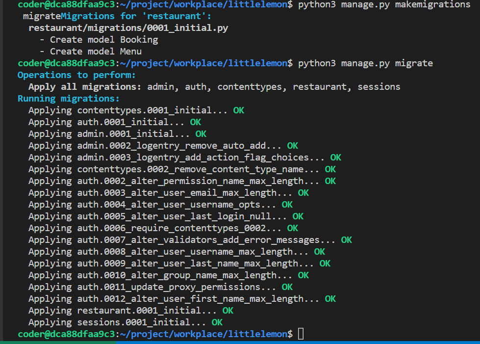
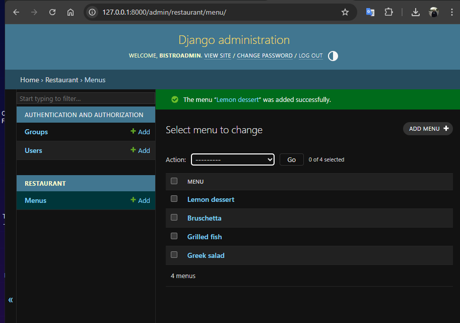
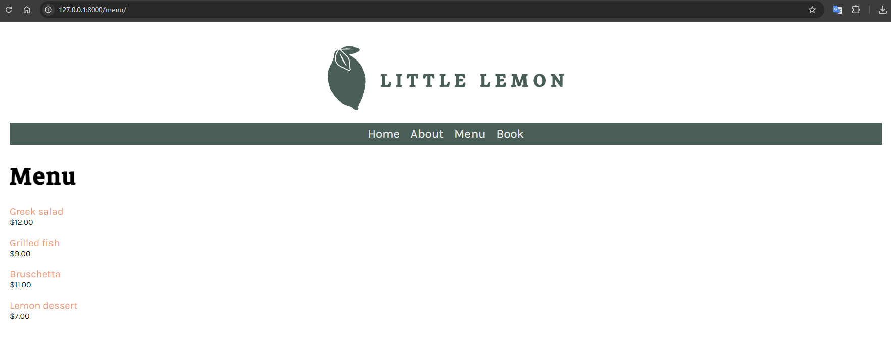
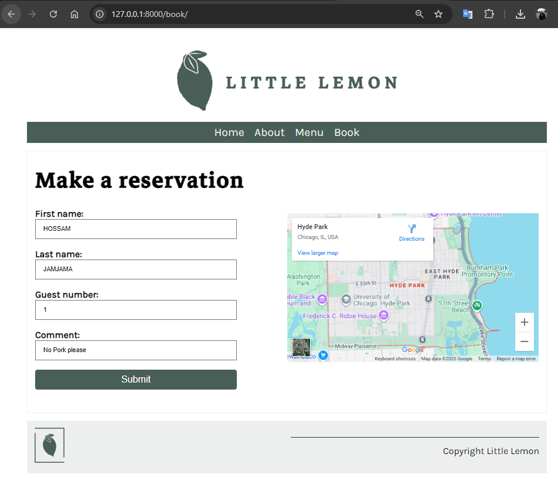
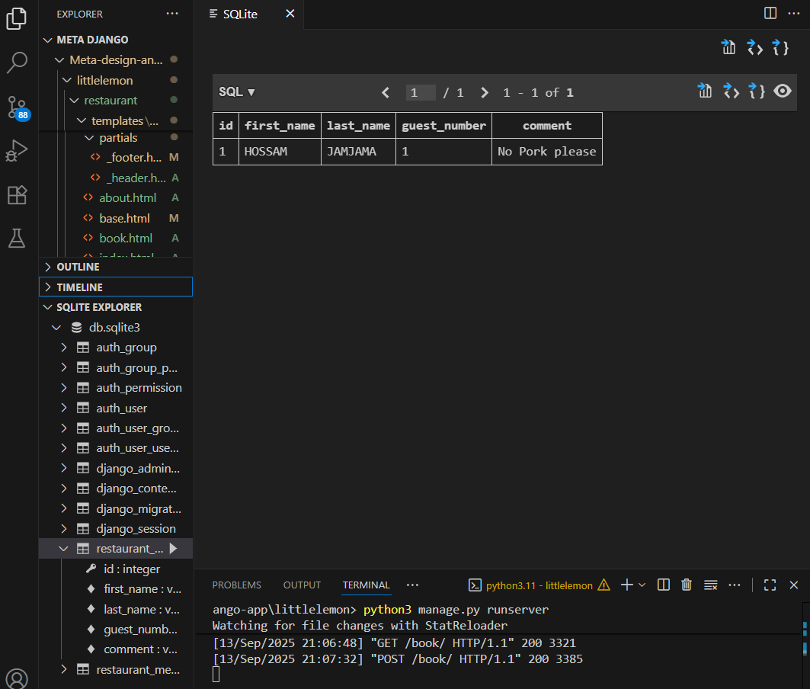

# Meta Django Course - Final Project: Design and Build a Simple Django App for Little Lemon

## Overview

Congratulations on completing the final graded assessment for the Meta Django course on Coursera! This project showcases the skills acquired in building a Django-based web application for Little Lemon, a local bistro owned by Mario and Adrian. The goal was to create a functional website with a Menu page and Menu Item page, integrating models, views, templates, and a footer, while leveraging Django's framework to enhance their digital presence. The application includes five pages—Home, About, Booking, Menu, and Menu Item—demonstrating proficiency in Django development.

## Technologies Used

- **Framework**: Django
- **Database**: SQLite3
- **Template Engine**: Django Template Language (DTL)
- **Styling**: CSS (pre-existing static files)
- **Dependencies**: Managed via `requirements.txt`

## Project Structure

```
.
├── littlelemon/             # Project directory
│   ├── __init__.py
│   ├── asgi.py
│   ├── settings.py          # Project settings
│   ├── urls.py              # Project-level URL configurations
│   └── wsgi.py
├── restaurant/              # App directory
│   ├── __init__.py
│   ├── admin.py             # Model registrations
│   ├── apps.py
│   ├── migrations/          # Migration files
│   ├── models.py            # Menu and Booking models
│   ├── templates/           # HTML templates
│   │   ├── restaurant/
│   │   │   ├── about.html
│   │   │   ├── book.html
│   │   │   ├── index.html
│   │   │   ├── menu.html     # Menu page template
│   │   │   ├── menu_item.html  # Menu Item page template
│   │   │   └── partials/
│   │   │       └── _footer.html  # Footer template
│   ├── tests.py
│   ├── urls.py              # App-level URL configurations
│   ├── views.py             # View functions
│   └── forms.py             # Pre-existing forms
├── db.sqlite3               # SQLite database
├── manage.py                # Django management script
├── requirements.txt         # Python dependencies (Django, pathlib)
├── static/                  # Static files (images, CSS)
│   ├── img/
│   │   ├── menu_items/      # Menu item images
│   │   └── logo_footer.png  # Footer logo
│   └── css/
└── screenshots/             # Evidence screenshots
    ├── 1-migration.PNG      # Successful migrations
    ├── 2-add-menu-items.PNG # Adding menu items in admin
    ├── 3-Little-Lemon-homepage.PNG  # Homepage demo
    ├── 4-menu-page.PNG      # Menu page demo
    ├── 5-menu-item-page.PNG # Menu item page demo
    ├── 6-booking.PNG        # Booking form demo
    └── 7-booking-data-in-database.PNG  # Database data
```

## Setup and Installation

1. **Clone the Repository**:
   ```
   git clone https://github.com/HossamJa/Meta-design-and-build-a-simple-Django-app.git
   cd Meta-design-and-build-a-simple-Django-app
   ```

2. **Set Up Virtual Environment**:
   ```
   python -m venv venv
   source venv/bin/activate  # On Windows: venv\Scripts\activate
   ```

3. **Install Dependencies**:
   ```
   pip install -r requirements.txt
   ```

4. **Apply Migrations**:
   ```
   python manage.py makemigrations
   python manage.py migrate
   ```

5. **Create Superuser**:
   ```
   python manage.py createsuperuser
   ```
   - Username: bistroadmin
   - Email: admin@littlelemon.com
   - Password: lemon@786!

6. **Run the Server**:
   ```
   python manage.py runserver
   ```
   - Access the app at `http://127.0.0.1:8000/`

### Homepage
  

## Features Implemented

### Part 1 – Create the Menu Page

- **Step 1-2**: Created the `Menu` model with `name` (CharField, max_length=200) and `price` (IntegerField) attributes, added `__str__()` method, and registered it in `admin.py`.
- **Step 3**: Ran migrations to update the database.
  
- **Step 4-5**: Verified URL configurations and created a superuser.
- **Step 6-7**: Added menu items via the Django admin panel.
  
- **Step 8-11**: Implemented the `menu()` view function and added the URL path in `urls.py`.
- **Step 12-14**: Designed `menu.html` with DTL to display menu items dynamically.
  

### Part 2 – Create the Menu Item Page

- **Step 1-2**: Updated `Menu` model with `description` (TextField, max_length=1000, default=''), ran migrations, and added descriptions in admin.
- **Step 3-4**: Created `display_menu_items` view with dynamic URL parameter (`pk`) to fetch menu item details.
- **Step 5-6**: Added URL path and linked menu items in `menu.html` with ``.
- **Step 7-9**: Built `menu_item.html` to display name, description, and price with static images.
  

### Part 3 – Create the Footer Template

- **Step 1-3**: Updated `_footer.html` with a static footer logo and copyright text, included it in `base.html`.
- **Tested Booking Functionality:** 
  

- **Verified data in `db.sqlite3`**:
  

## General Notes

- The project uses `littlelemon` as the project name and `restaurant` as the app name, reflecting a real-world scenario.
- Pre-existing files like `views.py`, `urls.py`, and templates provide a foundation, with modifications made as per the assessment.
- Static images and CSS are included for styling, enhancing the user interface.

## License


This project is based on Meta course materials and is intended for educational purposes. See the [LICENSE](LICENSE) file for details.
